# Single Sign-On (SSO)

For this guide we will be looking at setting up an **application** and also possibly configuring an **access policy** for the authorization server in Okta. While this guide is using Okta as an example, other OIDC or SAML2 providers, including Azure, can be used as well.


SSO is an additional Enterprise feature. Contact Duplicati sales or support if you need SSO enabled for your license or trial


### Create a Duplicati application in Okta

1. Sign in to your Okta account.
2. Navigate to the **Admin** page.
3. In the left menu, select **Applications**.


Ensure you have an Okta account available with **super admin rights**.&#x20;


<figure>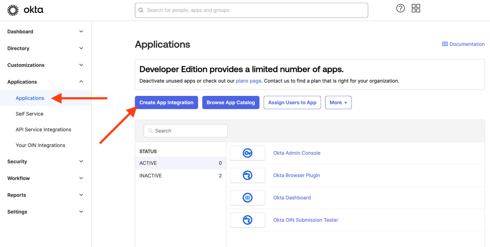<figcaption></figcaption></figure>

### Choose sign-in method and application type

In the daiglog for creating the application, choose these two options:

* **Sign-in method:** `OIDC - OpenID Connect`
* **Application type:** `Web Application`

Then click **Next**.

<figure>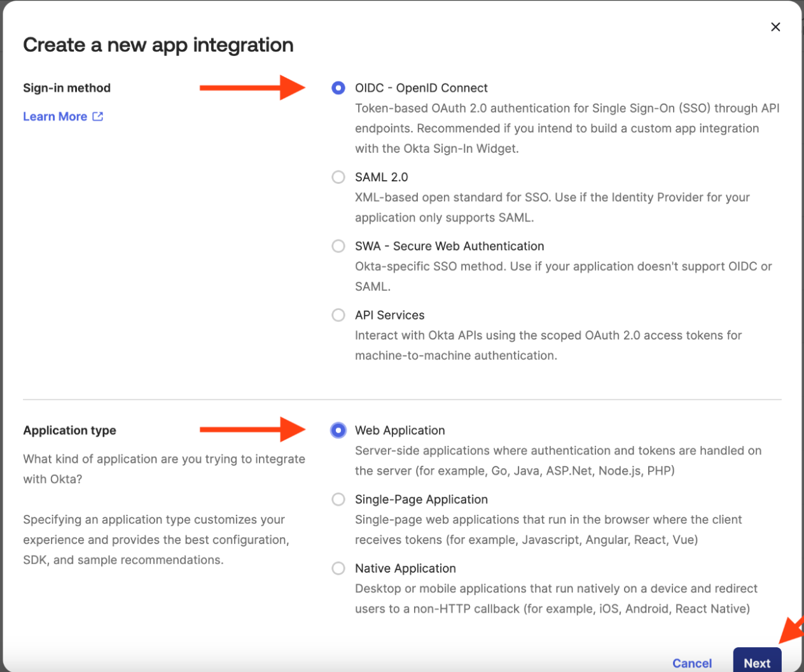<figcaption></figcaption></figure>

### Configure the Duplicati application in Okta

1. Choose a suitable application name, such as **Duplicati**.
2. Note that **Sign-in redirect URIs** must be provided later — leave it at default for now.
3. Set **controlled access**, preferably limiting access to selected groups for better control.

<figure>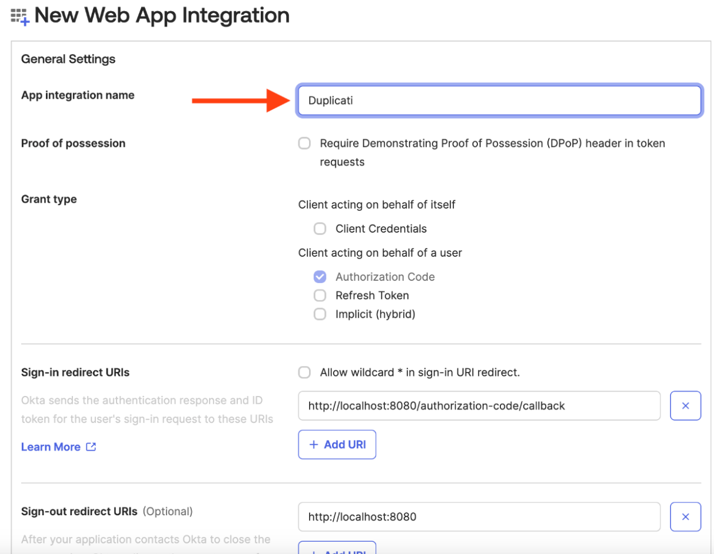<figcaption></figcaption></figure>

<figure>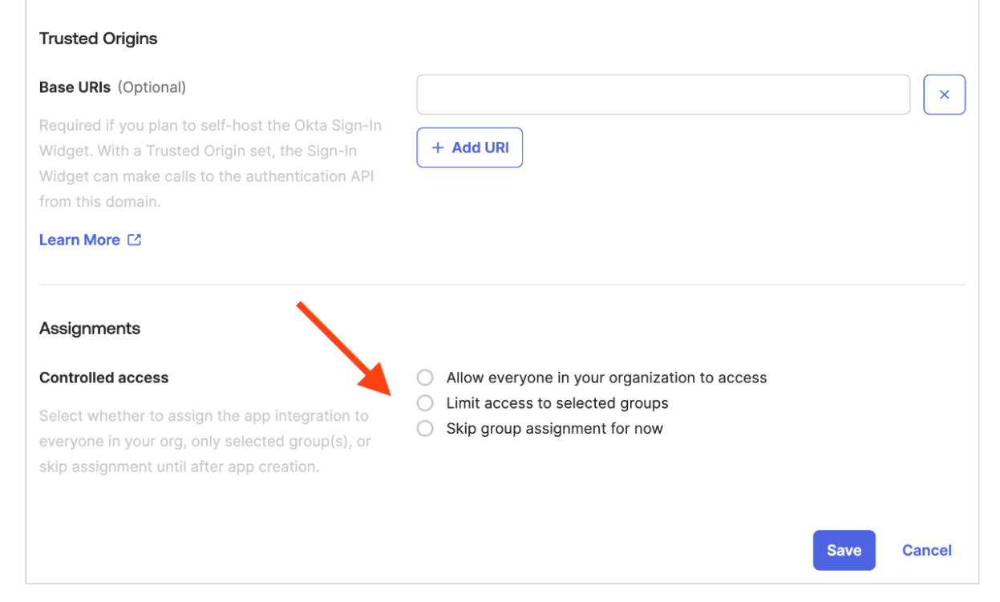<figcaption></figcaption></figure>

### Configure Access Policies for the Duplicati application in Okta

1. Go to **Security → API**.
2. Here you can:
   * Retrieve the **Metadata URI** needed for SSO configuration in Duplicati.
   * Verify existing **access policies**.

If no access policies are present, or you want another one:

1. Click **Add New Access Policy**.
2. Configure it to match your security requirements.

<figure>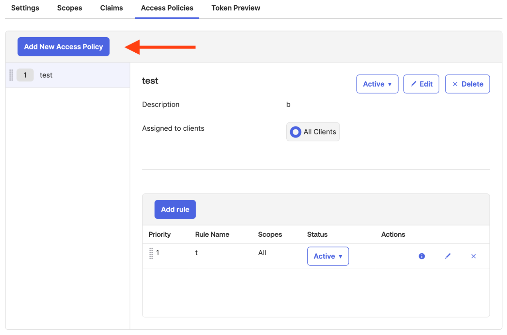<figcaption></figcaption></figure>

***

## Add Okta SSO to Duplicati

1. In the **Duplicati Console**, go to the [**Settings**](https://dev-app.duplicati.com/app/settings) page.
2. Click the **SSO** tab.
3. The **bold SSO name** (example shown as “SSO Demo”) is **case-sensitive** and is required later at login.
4. Click **New SSO Configuration** and choose **Add OIDC**.


If the SSO tab is not visible, SSO may not be enabled for your organization; contact Duplicati sales or support.


<figure>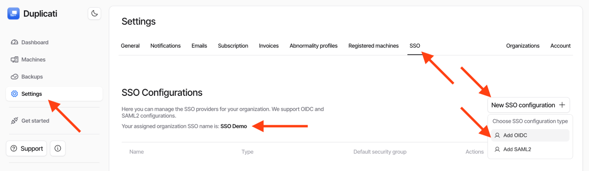<figcaption></figcaption></figure>

### Configure the OIDC connection in Duplicati Console

To configure OIDC, fill in values from the Okta application.

* **Name:** Used to identify the login method for users. A suggested name is **Okta**.
* **Notes:** Free text, only used in this dialog.
* **Default security group:**\
  New users must be assigned to a group to join the organization.\
  Select the standard **owner** group created with the organization.


The default group affects only users who have **not yet logged in** to Duplicati Console. It will **not change** the group(s) of existing users.


<div><figure><figcaption></figcaption></figure> <figure>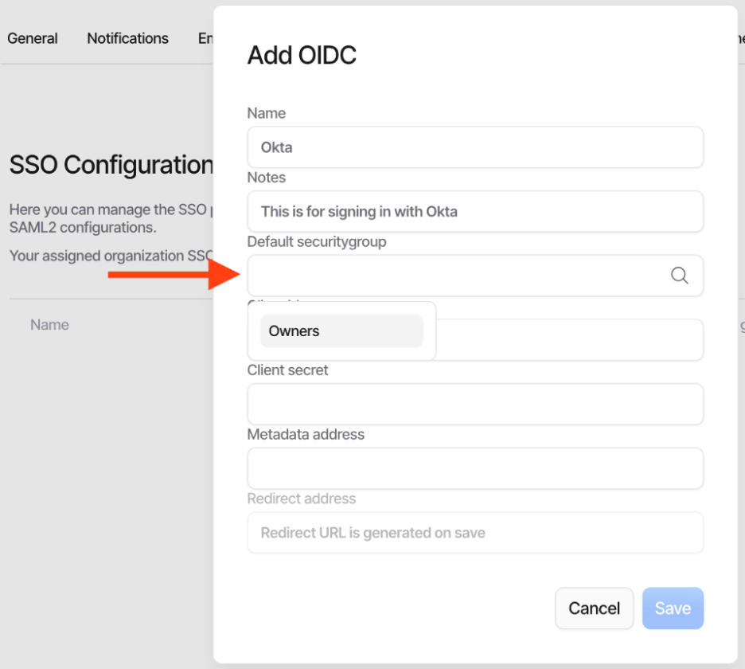<figcaption></figcaption></figure></div>

### Enter Client ID, Client Secret, and Metadata URI

1. In Okta, open your application page.
2. Copy:
   * **Client Id**
   * **Client secret**
3. Paste both into the Duplicati Console OIDC dialog.

<figure>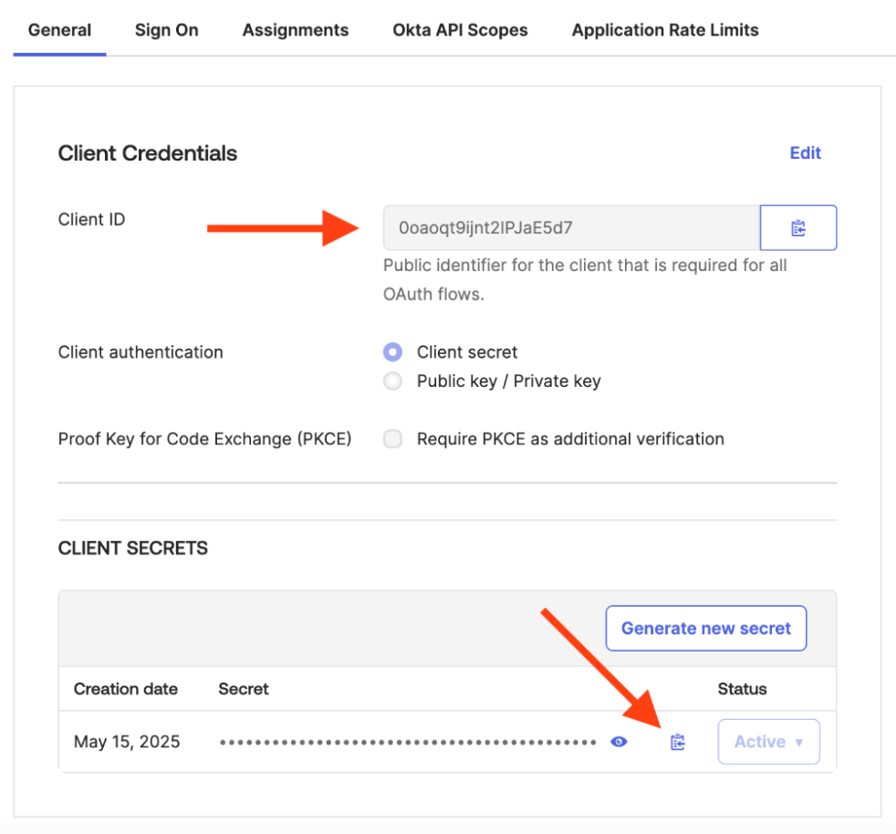<figcaption></figcaption></figure>

#### Metadata URI

1. In Okta, go to **Security → API → Settings**.
2. Copy the **Metadata URI** and paste into the **metadata address** field in Duplicati.

<figure>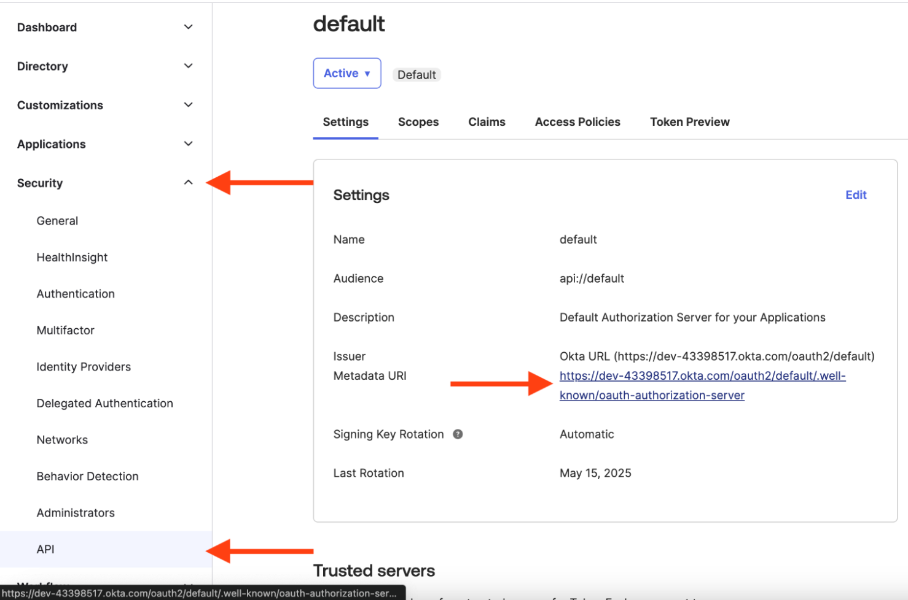<figcaption></figcaption></figure>

**If Metadata URI is not shown (some Okta plans):**

Use your Okta domain (from the Okta URL or Issuer field) in:

```
https://{yourOktaDomain}/.well-known/openid-configuration
```

### Initial configured OIDC dialog

Your configuration should look similar to the example shown in the guide once the fields are filled.

<figure>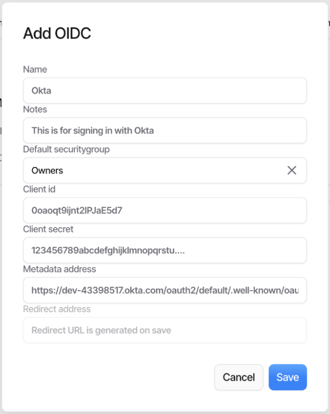<figcaption></figcaption></figure>

## Updating Okta for the connection

When creating the Okta app earlier, the redirect URI was left at default because it wasn’t available yet. Now we will update it.

### Obtain the redirect URI

1. In **Duplicati Console**, open the SSO configuration list.
2. For the relevant SSO configuration, open the action menu.
3. Click the **copy** button to copy the redirect URI.

<figure>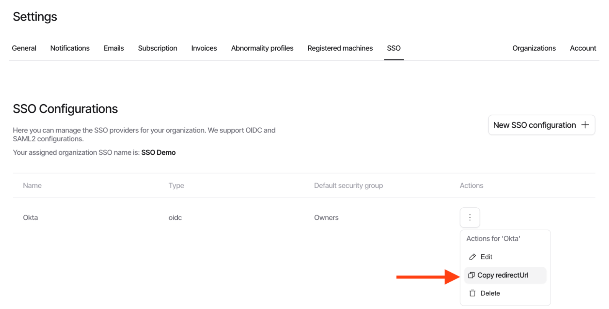<figcaption></figcaption></figure>

### Configure redirect URI in Okta

1. In Okta, open your application front page.
2. Scroll to **General Settings**.
3. Click **Edit**.
4. Paste the redirect URI into **Sign-in redirect URIs**.
5. Click **Save**.

<div><figure>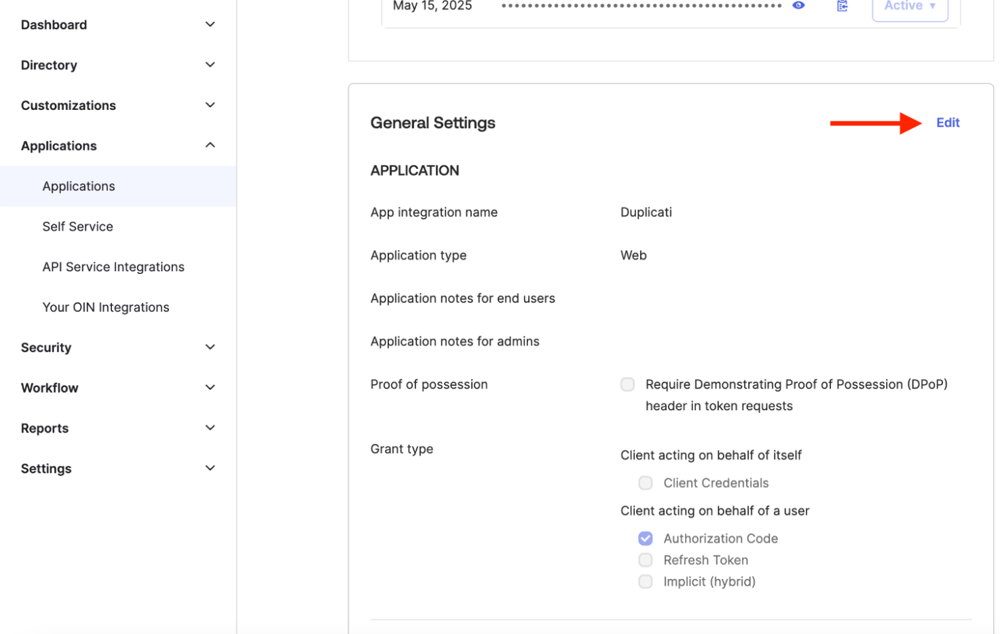<figcaption></figcaption></figure> <figure>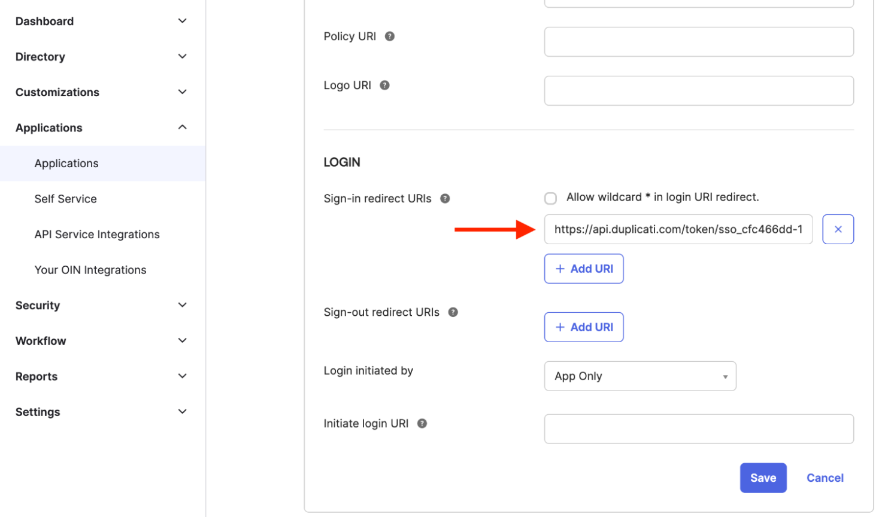<figcaption></figcaption></figure></div>

***

## Sign in with Okta SSO

Once configured, you can log in with Okta.

### Add Okta login to your existing account

1. In Duplicati Console, go to [your **Account** page](https://dev-app.duplicati.com/app/settings/account).
2. Click **Add login account**.
3. Choose the new Okta integration.

This allows your current account to be accessed with either login method.

<figure>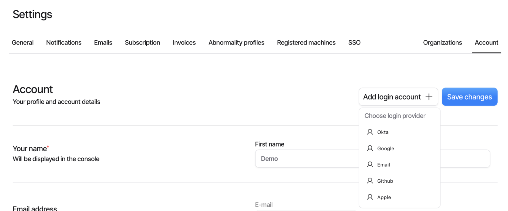<figcaption></figcaption></figure>

***

### New users logging in with Okta

1. Log out of Duplicati Console.
2. On the login screen, choose **Sign in with SSO**.
3. Enter your organization’s **SSO name** (case-sensitive).
   * The name appears on the SSO configuration page.
   * If not, obtain it from Duplicati Inc.
4. After entering a valid name, you’ll see available login options.
   * Typically there is one option, but multiple can be configured.
5. Click the login button to be redirected to Okta and complete sign-in.

<div><figure>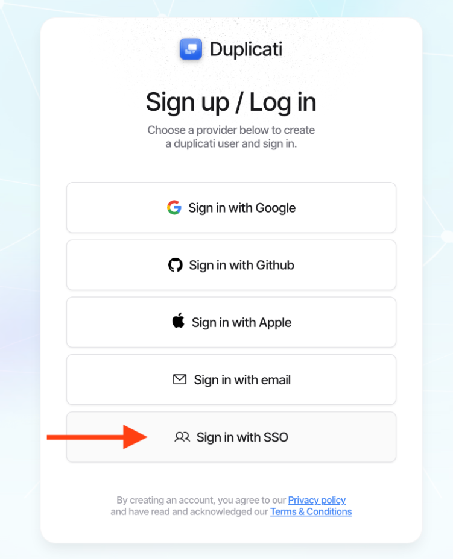<figcaption></figcaption></figure> <figure><figcaption></figcaption></figure> <figure><figcaption></figcaption></figure></div>
